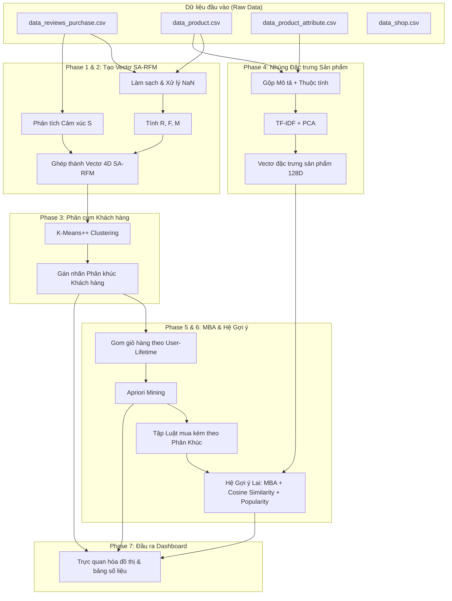

# Kiến Trúc Hệ Thống & Hướng Dẫn Vận Hành Dự Án

Dự án nghiên cứu: **"Multimodal Data Mining: Combining Unstructured Data and Market Basket Analysis based on the RFM model"** (Khai phá dữ liệu đa phương thức: Kết hợp dữ liệu phi cấu trúc và Phân tích giỏ hàng dựa trên mô hình RFM trong thương mại điện tử).

Tài liệu này mô tả chi tiết kiến trúc luồng dữ liệu (dữ liệu nào chạy vào mô-đun nào, dùng thuật toán gì) và hướng dẫn cách chạy từng phần của dự án.

---

## 1. Cấu Trúc Thư Mục Dự Án (Workspace Directory)

Các file mã nguồn được tổ chức theo tính mô-đun hóa cao trong thư mục `src/` và các kịch bản thực thi trực tiếp nằm ngoài thư mục gốc:

```text
DSP/
├── dataset/                  # Thư mục chứa dữ liệu
│   ├── before_EDA/           # 4 file CSV dữ liệu gốc ban đầu
│   └── after_EDA/            # Dữ liệu sạch, dữ liệu vectơ nhúng và gán nhãn cụm sau khi chạy
├── src/                      # Thư mục chứa các Modules mã nguồn lõi
│   ├── preprocessing/        # Module làm sạch dữ liệu & tính toán RFM
│   ├── sentiment/            # Module phân tích cảm xúc phản hồi (Sentiment)
│   ├── segmentation/         # Module phân tích phân cụm khách hàng
│   ├── embedding/            # Module tạo vectơ nhúng sản phẩm đa phương thức
│   ├── mba/                  # Module khai phá luật kết hợp giỏ hàng (Apriori)
│   ├── recommendation/       # Module hệ thống gợi ý lai (Hybrid Recommender)
│   └── visualization/        # Module vẽ biểu đồ báo cáo
├── outputs/                  # Thư mục kết quả đầu ra
│   ├── figures/              # Chứa các biểu đồ trực quan dạng .png
│   └── tables/               # Chứa các bảng số liệu, kết quả đánh giá dạng .csv
├── run_phase1.py             # Kịch bản thực thi Phase 1
├── run_phase2.py             # Kịch bản thực thi Phase 2
├── run_phase3.py             # Kịch bản thực thi Phase 3
├── run_phase4.py             # Kịch bản thực thi Phase 4
├── run_phase5.py             # Kịch bản thực thi Phase 5
├── run_phase6.py             # Kịch bản thực thi Phase 6
└── run_phase7.py             # Kịch bản thực thi Phase 7
```

---

## 2. Luồng Kiến Trúc Dự Án: Dùng gì để chạy gì?

Kiến trúc luồng xử lý của hệ thống gồm **7 giai đoạn liên hoàn (Phases)**:



---

## 3. Chi Tiết Các Giai Đoạn Thực Thi (Phases)

### Phase 1: Tiền Xử Lý Dữ Liệu & Tính RFM
* **Đầu vào**: `dataset/before_EDA/data_reviews_purchase.csv`, `data_product.csv`.
* **Thuật toán & Xử lý**: 
  * Đọc file dữ liệu giao dịch 369K dòng dạng luồng (line-by-line) để tối ưu bộ nhớ.
  * Làm sạch text, xử lý các giá trị khuyết thiếu (NaN) của bảng sản phẩm và thuộc tính.
  * Trích xuất các thuộc tính thời gian (năm, tháng, thứ, giờ mua hàng).
  * Tính toán chỉ số **Recency** (R - số ngày từ lần mua cuối), **Frequency** (F - số lần mua sắm) và **Monetary** (M - tổng giá trị chi tiêu) cho từng khách hàng.
  * Chuẩn hóa Min-Max các chỉ số, đảo ngược Recency để điểm càng cao tức là khách hàng mua càng gần đây.
* **Cách chạy**: `python run_phase1.py`
* **Đầu ra**: 
  * `dataset/after_EDA/reviews_cleaned.csv` (Dữ liệu giao dịch sạch).
  * `dataset/after_EDA/rfm_table.csv` (Bảng chỉ số RFM của 304,708 khách hàng).

---

### Phase 2: Phân Tích Cảm Xúc & Tích Hợp SA-RFM (RFMS)
* **Đầu vào**: `dataset/after_EDA/reviews_cleaned.csv`, `rfm_table.csv`.
* **Thuật toán & Xử lý**:
  * Mô hình tích hợp 2 chế độ: Thử nghiệm tải mô hình học sâu tiếng Việt **PhoBERT** (`vinai/phobert-base`) để phân loại cảm xúc từ văn bản review. Nếu môi trường không có GPU/PyTorch, hệ thống tự động kích hoạt chế độ dự phòng dựa trên điểm đánh giá `rating` (rating 1-5 ánh xạ về thang điểm [0, 1]).
  * Áp dụng thuật toán **Trọng số suy giảm theo thời gian (Recency-Weighted)**: các bình luận càng gần thời điểm hiện tại sẽ chiếm trọng số cao hơn trong hồ sơ cảm xúc của khách hàng.
  * Ghép chỉ số Cảm xúc (S - Sentiment) với RFM để tạo thành vectơ khách hàng 4 chiều **SA-RFM** (hay còn gọi là mô hình **RFMS**).
* **Cách chạy**: `python run_phase2.py`
* **Đầu ra**:
  * `dataset/after_EDA/sarfm_table.csv` (Bảng thông số RFMS đầy đủ).
  * `dataset/after_EDA/sarfm_vectors.csv` (Vectơ 4D chuẩn hóa phục vụ phân cụm).

---

### Phase 3: Phân Cụm Khách Hàng (Customer Segmentation)
* **Đầu vào**: `dataset/after_EDA/sarfm_vectors.csv`, `sarfm_table.csv`.
* **Thuật toán & Xử lý**:
  * Đánh giá số lượng cụm tối ưu từ $K=2$ đến $K=7$ thông qua 3 chỉ số: **Elbow** (WCSS), **Silhouette Score** (chạy trên tập mẫu 15K người dùng để tránh tràn RAM), và **Davies-Bouldin Index** (DBI).
  * Chạy mô hình phân cụm chính **K-Means++** với $K=5$ cụm tối ưu.
  * Chạy 2 mô hình so sánh đối chứng: **GMM** (Gaussian Mixture Model) và **BIRCH**.
  * Dựa trên vị trí trọng tâm (centroids) của cụm để tự động gán tên kinh doanh cho phân khúc (Champions, Detractors, Sleeping Giants,...).
* **Cách chạy**: `python run_phase3.py`
* **Đầu ra**:
  * `dataset/after_EDA/sarfm_segmented.csv` (Bảng dữ liệu khách hàng kèm nhãn phân cụm).
  * Biểu đồ tìm $K$ tối ưu: `outputs/figures/segmentation_evaluation.png`.
  * Biểu đồ so sánh đặc trưng centroid: `outputs/figures/segment_centroids_radar.png` (dạng đồ thị song song parallel coordinates).
  * Biểu đồ phân bố cụm 2D: `outputs/figures/segment_scatter_2d.png` (sử dụng PCA giảm chiều).

---

### Phase 4: Nhúng Đặc Trưng Sản Phẩm Đa Phương Thức
* **Đầu vào**: `dataset/after_EDA/products_cleaned.csv`, `attributes_cleaned.csv`.
* **Thuật toán & Xử lý**:
  * Gộp thông tin văn bản: Tên sản phẩm, thương hiệu, loại da, mô tả sản phẩm, thành phần (ingredients) và công dụng thành một văn bản duy nhất cho mỗi sản phẩm.
  * Sử dụng **TF-IDF + PCA** để trích xuất vectơ đặc trưng văn bản 128 chiều (hoặc `SentenceTransformer` multilingual-MiniLM làm chế độ nâng cao).
  * Tạo vectơ đặc trưng hình ảnh giả lập (mock visual embedding) bằng thuật toán băm tên file ảnh (hash) do các file ảnh gốc không có sẵn trên đĩa.
  * Mã hóa các biến danh mục (Thương hiệu, Loại da, Nguồn gốc) và chuẩn hóa Min-Max các biến số (Giá, Điểm sao, Lượt bán).
  * Ghép các vectơ đặc trưng (Văn bản + Hình ảnh + Metadata) rồi giảm chiều qua PCA về **128 chiều** cuối cùng cho mỗi sản phẩm.
* **Cách chạy**: `python run_phase4.py`
* **Đầu ra**:
  * `dataset/after_EDA/product_embeddings.csv` (Vectơ đặc trưng sản phẩm).
  * `dataset/after_EDA/product_mapping.csv` (File ánh xạ tên sản phẩm để tra cứu nhanh).

---

### Phase 5: Khai Phá Luật Kết Hợp Giỏ Hàng (Semantic MBA)
* **Đầu vào**: `dataset/after_EDA/reviews_cleaned.csv`, `sarfm_segmented.csv`, `product_embeddings.csv`.
* **Thuật toán & Xử lý**:
  * Gom lịch sử mua sắm của từng khách hàng qua thời gian thành các giỏ hàng (baskets) ở cấp độ **User-Lifetime** (lọc ra 28,477 giỏ hàng có từ 2 sản phẩm trở lên).
  * Xây dựng bộ khai phá luật kết hợp **Apriori** viết bằng Python tối ưu để tìm các cặp sản phẩm thường mua cùng nhau (với ngưỡng Support $\ge$ 0.0005, Confidence $\ge$ 0.05, Lift $\ge$ 1.2).
  * Khai phá luật kết hợp riêng biệt cho từng cụm khách hàng (Segment-Aware MBA).
  * Làm phong phú luật kết hợp bằng chỉ số **Tương đồng Ngữ nghĩa Cosine (Cosine Similarity)** giữa vectơ nhúng đa phương thức của 2 sản phẩm mua kèm.
* **Cách chạy**: `python run_phase5.py`
* **Đầu ra**:
  * `outputs/tables/global_association_rules.csv` (Luật kết hợp toàn cục).
  * Các file luật kết hợp của từng phân cụm cụ thể tại `outputs/tables/segment_rules_*.csv`.

---

### Phase 6: Thiết Kế & Đánh Giá Hệ Gợi Ý Lai
* **Đầu vào**: Dữ liệu lịch sử khách hàng, nhãn phân cụm khách hàng, các luật kết hợp giỏ hàng và ma trận nhúng sản phẩm.
* **Thuật toán & Xử lý**:
  * Xây dựng hệ gợi ý lai (Hybrid Recommender) chấm điểm sản phẩm ứng viên cho mỗi người dùng dựa trên 3 tiêu chí:
    $$\text{Score} = w_{\text{mba}} \cdot \text{Score}_{\text{MBA}} + w_{\text{sim}} \cdot \text{Similarity}_{\text{Cosine}} + w_{\text{pop}} \cdot \text{Score}_{\text{Popularity}}$$
    (Mặc định tỷ lệ trọng số là: MBA 40%, Content Similarity 40%, Popularity 20%).
  * Loại bỏ các sản phẩm khách hàng đã mua trước đó.
  * Tự động tạo câu lý giải (explanations) cho từng sản phẩm gợi ý dựa trên hành vi mua kèm của cụm hoặc sự tương đồng về thành phần/công dụng.
  * Đánh giá hệ thống trên **200 người dùng ngẫu nhiên** thông qua chỉ số Độ phủ danh mục (Catalog Coverage) và Độ đa dạng (Diversity).
* **Cách chạy**: `python run_phase6.py`
* **Đầu ra**:
  * `outputs/tables/recommender_samples.csv` (Kết quả gợi ý mẫu cho đại diện các phân khúc).
  * `outputs/tables/recommender_evaluation_metrics.csv` (Các chỉ số đánh giá chất lượng hệ gợi ý).

---

### Phase 7: Tổng Hợp Biểu Đồ Dashboard Báo Cáo
* **Đầu vào**: Các file số liệu kết quả từ thư mục `outputs/tables/` và `dataset/after_EDA/`.
* **Cách chạy**: `python run_phase7.py`
* **Đầu ra**: 4 biểu đồ báo cáo được lưu vào thư mục [outputs/figures/](file:///c:/Users/david/OneDrive/Documents/DSP/outputs/figures):
  * `dashboard_segment_sizes.png` (Tỷ lệ phần trăm phân bố người dùng của 5 cụm).
  * `dashboard_sentiment_dist.png` (Phân bố tần suất cảm xúc người dùng).
  * `dashboard_mba_rules_scatter.png` (Phân phối của luật kết hợp: màu sắc theo Lift, kích thước theo Cosine Similarity).
  * `dashboard_recommender_hits.png` (Biểu đồ cột so sánh nguồn gốc đóng góp cấu thành nên danh sách gợi ý).

---

## 4. Công Nghệ Sử Dụng (Technology Stack)
* **Ngôn ngữ**: Python 3.10+
* **Xử lý số liệu**: `pandas`, `numpy`
* **Học máy / Phân cụm**: `scikit-learn` (KMeans, GMM, Birch, PCA, MinMaxScaler, LabelEncoder)
* **Vẽ biểu đồ**: `matplotlib`, `seaborn`
* **Học sâu (Chế độ nâng cao)**: `transformers`, `sentence-transformers`, `torch`
