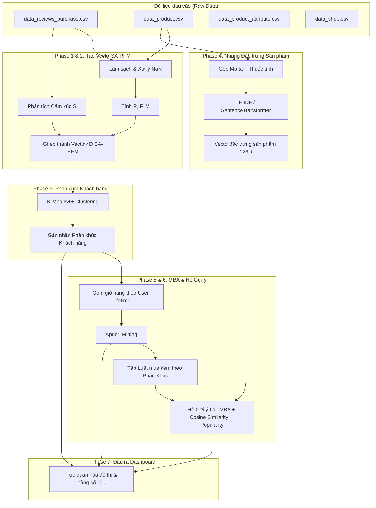

# Khai Phá Dữ Liệu Đa Phương Thức: Phân Khúc Khách Hàng SA-RFM & Hệ Gợi Ý Lai (Semantic MBA)

Dự án nghiên cứu: **"Multimodal Data Mining: Combining Unstructured Data and Market Basket Analysis based on the RFM model"** (Khai phá dữ liệu đa phương thức: Kết hợp dữ liệu phi cấu trúc và Phân tích giỏ hàng dựa trên mô hình RFM trong thương mại điện tử).

Dự án này triển khai một hệ thống đầu-cuối (end-to-end pipeline) nhằm phân tích hành vi khách hàng từ dữ liệu giao dịch và phản hồi (reviews) của nền tảng thương mại điện tử Tiki, kết hợp với các thuộc tính và mô tả sản phẩm đa phương thức để xây dựng hệ gợi ý cá nhân hóa cao.

---

## 🌟 Các Đặc Điểm Nổi Bật (Highlights)

1. **Tiền Xử Lý Dữ Liệu Lớn**: Xử lý ổn định hơn 369K dòng đánh giá/giao dịch bằng cơ chế đọc theo luồng (chunked reader) để tránh lỗi tràn bộ nhớ (segfault) và tối ưu hóa tài nguyên hệ thống.
2. **SA-RFM (RFMS) - Mô Hình Khách Hàng 4 Chiều**: Tích hợp khía cạnh Cảm Xúc (Sentiment - S) vào mô hình RFM truyền thống. Áp dụng trọng số suy giảm theo thời gian (Recency-Weighted Sentiment) giúp nắm bắt sát sao trạng thái tâm lý khách hàng gần nhất.
3. **Phân Cụm Khách Hàng Đa Mô Hình**: So sánh K-Means++, Gaussian Mixture Model (GMM) và BIRCH trên các chỉ số WCSS (Elbow), Silhouette Score, và Davies-Bouldin Index (DBI) để chia tệp khách hàng thành 5 phân khúc kinh doanh rõ rệt.
4. **Vectơ Nhúng Sản Phẩm Đa Phương Thức (Multimodal Product Embeddings)**: Kết hợp mô tả văn bản (TF-IDF / SentenceTransformer), thông tin hình ảnh giả lập (hash-based visual) và metadata sản phẩm (giá, xếp hạng, thương hiệu) vào một không gian nhúng chung 128 chiều.
5. **Khai Phá Luật Kết Hợp Giỏ Hàng Ngữ Nghĩa (Semantic MBA)**: Sử dụng thuật toán Apriori thuần Python tự xây dựng để khai phá các cặp sản phẩm thường mua cùng nhau, kết hợp đo lường độ tương đồng ngữ nghĩa Cosine Similarity giữa các vectơ nhúng sản phẩm.
6. **Hệ Gợi Ý Lai Phân Khúc (Segment-Aware Hybrid Recommender)**: Kết hợp 3 thành phần điểm số (MBA Rules + Cosine Content Similarity + Popularity) và tự động tạo câu lý giải (explanations) bằng ngôn ngữ tự nhiên phù hợp với từng phân khúc khách hàng.
7. **Báo Cáo Dashboard Trực Quan**: Tự động xuất 4 đồ thị nghiên cứu chính (phân phối cụm, cảm xúc khách hàng, phân bố luật kết hợp theo Lift & Độ tương đồng ngữ nghĩa, và cơ cấu nguồn gợi ý).

---

## 📐 Kiến Trúc Luồng Dữ Liệu (7-Phase Pipeline)

Hệ thống được chia làm 7 giai đoạn thực thi liên hoàn:



---

## 📂 Cấu Trúc Thư Mục Dự Án (Workspace Directory)

Các module mã nguồn được tổ chức theo tính mô-đun hóa trong thư mục `src/` và các kịch bản thực thi trực tiếp nằm ở thư mục gốc:

```text
DSP/
├── dataset/                      # Thư mục chứa dữ liệu dự án
│   ├── before_EDA/               # Chứa 4 file dữ liệu thô (.csv) ban đầu từ Tiki
│   └── after_EDA/                # Dữ liệu sạch, bảng RFMS, vectơ nhúng sản phẩm và phân cụm sau khi chạy
├── src/                          # Các Module mã nguồn lõi
│   ├── preprocessing/            # Xử lý dữ liệu thô và tính toán chỉ số RFM cơ bản
│   ├── sentiment/                # Module phân tích cảm xúc phản hồi (Sentiment)
│   ├── segmentation/             # Phân cụm khách hàng bằng thuật toán KMeans++, GMM, BIRCH
│   ├── embedding/                # Tạo vectơ nhúng sản phẩm đa phương thức
│   ├── mba/                      # Khai phá luật kết hợp giỏ hàng Apriori
│   ├── recommendation/           # Triển khai thuật toán gợi ý lai (Hybrid Recommender)
│   └── visualization/            # Tạo đồ thị báo cáo trực quan hóa
├── outputs/                      # Thư mục chứa kết quả phân tích đầu ra
│   ├── figures/                  # Lưu trữ các biểu đồ (.png) báo cáo trực quan
│   ├── tables/                   # Lưu trữ kết quả phân tích định lượng (.csv)
│   └── models/                   # Lưu các mô hình máy học đã huấn luyện (.joblib)
├── run_phase1.py                 # Kịch bản thực thi Phase 1
├── run_phase2.py                 # Kịch bản thực thi Phase 2
├── run_phase3.py                 # Kịch bản thực thi Phase 3
├── run_phase4.py                 # Kịch bản thực thi Phase 4
├── run_phase5.py                 # Kịch bản thực thi Phase 5
├── run_phase6.py                 # Kịch bản thực thi Phase 6
├── run_phase7.py                 # Kịch bản thực thi Phase 7
├── kaggle_run_all.py             # Kịch bản chạy gộp toàn bộ 7 Phases trên Kaggle Notebook
├── PROJECT_ARCHITECTURE.md        # Tài liệu kiến trúc chi tiết dự án
└── README.md                     # Tài liệu tổng quát dự án (file này)
```

---

## 🛠️ Hướng Dẫn Cài Đặt & Chạy Hệ Thống

### 1. Chuẩn bị môi trường
Yêu cầu Python version 3.10 trở lên. Hãy cài đặt các thư viện cần thiết bằng câu lệnh:
```bash
pip install pandas numpy scikit-learn matplotlib seaborn joblib
```
*(Nếu muốn sử dụng mô hình học sâu PhoBERT và SentenceTransformers, hãy cài đặt thêm: `pip install torch transformers sentence-transformers`)*

### 2. Thực thi từng Phase trên máy cục bộ (Local Environment)
Bạn chạy tuần tự các kịch bản thực thi ở thư mục gốc:

1. **Phase 1: Tiền xử lý dữ liệu & Tính RFM**
   ```bash
   python run_phase1.py
   ```
   *Đầu ra*: Tạo dữ liệu giao dịch sạch `reviews_cleaned.csv` và bảng RFM thô `rfm_table.csv` tại `dataset/after_EDA/`.

2. **Phase 2: Phân tích cảm xúc & Tích hợp SA-RFM (RFMS)**
   ```bash
   python run_phase2.py
   ```
   *Đầu ra*: Tạo bảng dữ liệu cảm xúc kết hợp RFMS `sarfm_table.csv` và các vectơ đặc trưng chuẩn hóa `sarfm_vectors.csv`.

3. **Phase 3: Phân cụm khách hàng**
   ```bash
   python run_phase3.py
   ```
   *Đầu ra*: Nhãn phân cụm khách hàng `sarfm_segmented.csv` và các biểu đồ phân tích cụm tại `outputs/figures/`.

4. **Phase 4: Nhúng đặc trưng sản phẩm đa phương thức**
   ```bash
   python run_phase4.py
   ```
   *Đầu ra*: Tạo ma trận nhúng sản phẩm `product_embeddings.csv` 128 chiều và file tra cứu thông tin sản phẩm `product_mapping.csv`.

5. **Phase 5: Khai phá luật kết hợp giỏ hàng ngữ nghĩa**
   ```bash
   python run_phase5.py
   ```
   *Đầu ra*: Tập luật mua kèm toàn cục `global_association_rules.csv` và tập luật riêng cho từng phân khúc tại `outputs/tables/`.

6. **Phase 6: Thiết kế và Đánh giá hệ gợi ý lai**
   ```bash
   python run_phase6.py
   ```
   *Đầu ra*: Kết quả gợi ý mẫu cho các đại diện phân cụm `recommender_samples.csv` và các chỉ số đo lường hiệu quả hệ thống.

7. **Phase 7: Tổng hợp biểu đồ báo cáo**
   ```bash
   python run_phase7.py
   ```
   *Đầu ra*: Tạo 4 biểu đồ dashboard phân tích tại `outputs/figures/`.

### 3. Chạy gộp toàn bộ trên Kaggle
Nếu bạn sử dụng môi trường Kaggle Notebook với hỗ trợ GPU (T4 hoặc P100):
1. Nén toàn bộ dự án (đặc biệt thư mục `src/`) và tải lên Kaggle làm Dataset (`dsp-code`).
2. Thêm các dataset chứa dữ liệu thô ban đầu (`tiki-before-eda`).
3. Thực thi thông qua file [kaggle_run_all.py](file:///c:/Users/david/OneDrive/Documents/DSP/kaggle_run_all.py):
   ```python
   import subprocess, sys
   subprocess.run([sys.executable, "kaggle_run_all.py"])
   ```

---

## 🔍 Chi Tiết Các Phân Hệ Chức Năng (Thư mục `src/`)

Dưới đây là chi tiết mã nguồn triển khai của từng phân hệ chức năng trong dự án:

### 1. Phân hệ Tiền Xử Lý Dữ Liệu
* **File mã nguồn chính**: [preprocess.py](file:///c:/Users/david/OneDrive/Documents/DSP/src/preprocessing/preprocess.py)
* **Kịch bản thực thi**: [run_phase1.py](file:///c:/Users/david/OneDrive/Documents/DSP/run_phase1.py)
* **Thuật toán & Xử lý**:
  * Đọc tệp giao dịch đánh giá từ Tiki bằng `csv.DictReader` theo luồng để tiết kiệm RAM.
  * Làm sạch văn bản tiếng Việt (loại bỏ URL, chuẩn hóa khoảng trắng, viết thường).
  * Điền khuyết dữ liệu cho thuộc tính sản phẩm (`ingredient` -> `'unknown'`, `skin_type` -> `'all_skin'`, `brand` -> `'no_brand'`,...).
  * Trích xuất các chiều thời gian (năm, tháng, thứ, giờ mua hàng).
  * Tính toán chỉ số Recency (số ngày từ lần mua cuối), Frequency (số giao dịch), và Monetary (tổng chi tiêu) cho từng khách hàng, sau đó chuẩn hóa Min-Max.

### 2. Phân hệ Phân Tích Cảm Xúc & SA-RFM
* **Kịch bản thực thi**: [run_phase2.py](file:///c:/Users/david/OneDrive/Documents/DSP/run_phase2.py)
* **Thuật toán & Xử lý**:
  * Sử dụng mô hình học sâu tiếng Việt **PhoBERT** (`vinai/phobert-base`) để phân tích cảm xúc từ phản hồi văn bản của khách hàng.
  * Nếu không có GPU/PyTorch, hệ thống tự động fallback sang chế độ ánh xạ tuyến tính điểm đánh giá số (`rating` từ 1-5 về thang điểm cảm xúc [0.0, 1.0]).
  * Áp dụng thuật toán **Trọng số suy giảm theo thời gian (Recency-Weighted Sentiment)**: Các review gần nhất chiếm trọng số lớn hơn để phản ánh đúng tâm lý hiện tại của khách hàng.
  * Kết xuất vectơ 4 chiều SA-RFM (Recency, Frequency, Monetary, Sentiment).

### 3. Phân hệ Phân Cụm Khách Hàng
* **File mã nguồn chính**: [segmentation.py](file:///c:/Users/david/OneDrive/Documents/DSP/src/segmentation/segmentation.py)
* **Kịch bản thực thi**: [run_phase3.py](file:///c:/Users/david/OneDrive/Documents/DSP/run_phase3.py)
* **Thuật toán & Xử lý**:
  * Đánh giá chất lượng phân cụm từ $K=2$ đến $K=7$ dựa trên WCSS (Elbow), Silhouette Score và Davies-Bouldin Index.
  * Tiến hành phân cụm khách hàng chính bằng thuật toán **K-Means++** với $K=5$ cụm tối ưu, đối chứng với GMM và BIRCH.
  * Gán nhãn kinh doanh dựa trên vị trí trọng tâm (centroids) của từng cụm:
    * 🏆 **Champions**: Khách VIP mua gần, mua nhiều, chi tiêu lớn, cảm xúc rất tích cực.
    * ⚠️ **Loyal Critics (Dissatisfied VIPs)**: Khách VIP chi tiêu nhiều nhưng cảm xúc tiêu cực (cần chăm sóc đặc biệt).
    * 🌱 **Promising Newcomers (Satisfied)**: Khách mới mua gần đây, cảm xúc tích cực.
    * 😴 **Sleeping Giants (Hibernating VIPs)**: Khách VIP đã lâu không quay lại mua sắm nhưng cảm xúc tích cực.
    * 💀 **Lost & Frustrated**: Khách đã lâu không mua, chi tiêu cực thấp, kèm cảm xúc tiêu cực.

### 4. Phân hệ Nhúng Đặc Trưng Sản Phẩm Đa Phương Thức
* **File mã nguồn chính**: [product_embedding.py](file:///c:/Users/david/OneDrive/Documents/DSP/src/embedding/product_embedding.py)
* **Kịch bản thực thi**: [run_phase4.py](file:///c:/Users/david/OneDrive/Documents/DSP/run_phase4.py)
* **Thuật toán & Xử lý**:
  * Ghép các trường văn bản mô tả sản phẩm (Tên, Thương hiệu, Phân loại, Thành phần, Công dụng) thành chuỗi đặc trưng văn bản sản phẩm.
  * Chuyển hóa văn bản bằng mô hình học sâu **SentenceTransformers** (`paraphrase-multilingual-MiniLM-L12-v2`) hoặc fallback bằng phương pháp **TF-IDF + PCA**.
  * Sử dụng giải thuật băm tên tệp hình ảnh deterministic hash-based làm đặc trưng hình ảnh giả lập (do dữ liệu ảnh vật lý không được lưu trữ cục bộ).
  * Sử dụng Label Encoder cho các trường phân loại và MinMaxScaler cho các trường số (giá cả, sao đánh giá, lượt bán).
  * Ghép các thành phần vectơ đặc trưng và giảm chiều PCA về không gian vectơ **128 chiều** thống nhất cho mỗi sản phẩm.

### 5. Phân hệ Khai Phá Luật Kết Hợp Giỏ Hàng
* **File mã nguồn chính**: [mba.py](file:///c:/Users/david/OneDrive/Documents/DSP/src/mba/mba.py)
* **Kịch bản thực thi**: [run_phase5.py](file:///c:/Users/david/OneDrive/Documents/DSP/run_phase5.py)
* **Thuật toán & Xử lý**:
  * Gom lịch sử mua sắm của từng khách hàng qua thời gian thành các giỏ hàng ở cấp độ trọn đời (User-Lifetime basket).
  * Khai phá luật kết hợp bằng thuật toán **Apriori** viết bằng Python thuần tối ưu hóa (Support $\ge$ 0.0005, Confidence $\ge$ 0.05, Lift $\ge$ 1.2).
  * Triển khai hai hướng song song: Khai phá luật kết hợp toàn cục (Global Rules) và luật kết hợp riêng biệt theo phân khúc khách hàng (Segment-Aware Rules).
  * Nâng cao chất lượng luật mua kèm bằng việc tính toán độ tương đồng ngữ nghĩa Cosine Similarity giữa các vectơ nhúng sản phẩm đã học ở Phase 4.

### 6. Phân hệ Hệ Gợi Ý Lai Phân Khúc
* **File mã nguồn chính**: [recommender.py](file:///c:/Users/david/OneDrive/Documents/DSP/src/recommendation/recommender.py)
* **Kịch bản thực thi**: [run_phase6.py](file:///c:/Users/david/OneDrive/Documents/DSP/run_phase6.py)
* **Thuật toán & Xử lý**:
  * Xây dựng giải thuật gợi ý lai chấm điểm ứng viên cho từng khách hàng dựa trên 3 tiêu chí:
    $$\text{Score} = w_{\text{mba}} \cdot \text{Score}_{\text{MBA}} + w_{\text{sim}} \cdot \text{Similarity}_{\text{Cosine}} + w_{\text{pop}} \cdot \text{Score}_{\text{Popularity}}$$
    Trong đó:
    * $\text{Score}_{\text{MBA}}$: Điểm quy đổi từ luật mua kèm giỏ hàng (ưu tiên luật riêng của phân cụm khách hàng).
    * $\text{Similarity}_{\text{Cosine}}$: Độ tương đồng nội dung đa phương thức của sản phẩm ứng viên với lịch sử mua sắm của người dùng.
    * $\text{Score}_{\text{Popularity}}$: Điểm độ phổ biến dựa trên lượt bán và xếp hạng sao trung bình của sản phẩm trên sàn.
  * Tự động loại bỏ các sản phẩm đã mua để tránh gợi ý lặp trùng lặp.
  * Tự động sinh câu thuyết minh lý giải lý do gợi ý phù hợp với hành vi mua kèm của cụm hoặc sự tương đồng về thành phần/công dụng.

### 7. Phân hệ Dashboard & Trực Quan Hóa
* **File mã nguồn chính**: [dashboard.py](file:///c:/Users/david/OneDrive/Documents/DSP/src/visualization/dashboard.py)
* **Kịch bản thực thi**: [run_phase7.py](file:///c:/Users/david/OneDrive/Documents/DSP/run_phase7.py)
* **Thuật toán & Xử lý**:
  * Đọc kết quả từ các file CSV đầu ra để vẽ đồ thị bằng Matplotlib và Seaborn.
  * Đồ thị xuất ra dạng PNG được lưu tại thư mục [outputs/figures/](file:///c:/Users/david/OneDrive/Documents/DSP/outputs/figures):
    * `dashboard_segment_sizes.png`: Phân bố tỷ lệ quy mô 5 cụm khách hàng.
    * `dashboard_sentiment_dist.png`: Phân bố điểm cảm xúc khách hàng.
    * `dashboard_mba_rules_scatter.png`: Bong bóng phân phối luật kết hợp giỏ hàng (Lift, Support, Confidence, Cosine Similarity).
    * `dashboard_recommender_hits.png`: So sánh tỷ trọng đóng góp cấu thành danh sách gợi ý.

---

## 📈 Đánh Giá Kết Quả Thực Nghiệm

Kết quả phân tích định lượng được ghi nhận tự động trong thư mục [outputs/tables/](file:///c:/Users/david/OneDrive/Documents/DSP/outputs/tables):
* [clustering_evaluation_metrics.csv](file:///c:/Users/david/OneDrive/Documents/DSP/outputs/tables/clustering_evaluation_metrics.csv): Chỉ số đánh giá số lượng cụm tối ưu.
* [model_comparison.csv](file:///c:/Users/david/OneDrive/Documents/DSP/outputs/tables/model_comparison.csv): So sánh hiệu quả thuật toán KMeans, GMM và BIRCH.
* [global_association_rules.csv](file:///c:/Users/david/OneDrive/Documents/DSP/outputs/tables/global_association_rules.csv): Tập luật khai phá giỏ hàng toàn hệ thống.
* [recommender_evaluation_metrics.csv](file:///c:/Users/david/OneDrive/Documents/DSP/outputs/tables/recommender_evaluation_metrics.csv): Đo lường độ đa dạng (Diversity) và độ phủ catalog (Catalog Coverage) của hệ gợi ý lai.

Để biết chi tiết hơn về các cơ sở thuật toán và phương pháp nghiên cứu, vui lòng tham khảo file tài liệu chuyên sâu [PROJECT_ARCHITECTURE.md](file:///c:/Users/david/OneDrive/Documents/DSP/PROJECT_ARCHITECTURE.md).
